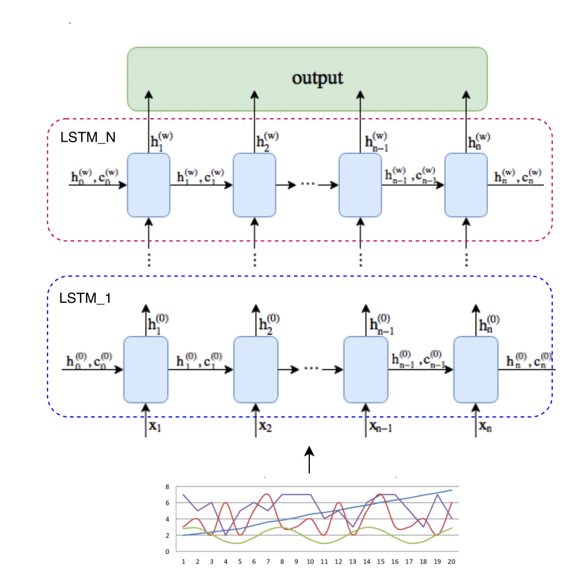
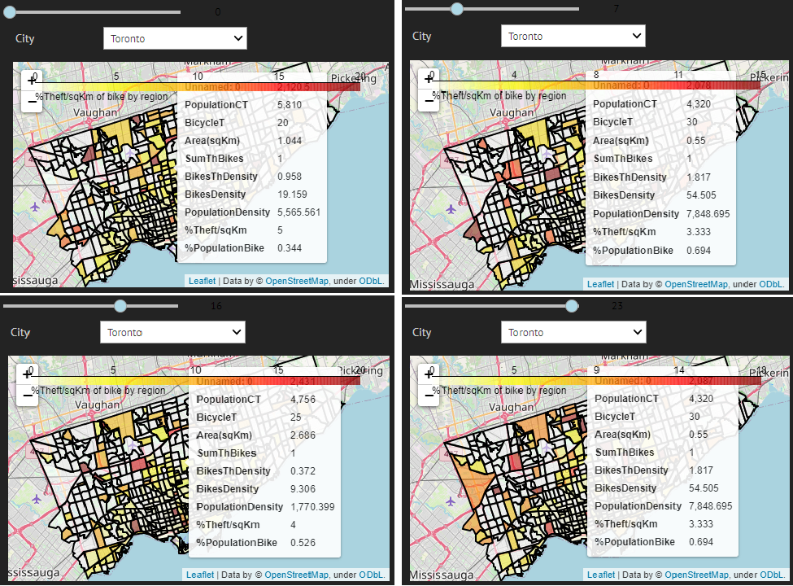

[![Contributors][contributors-shield]][contributors-url]
[![Forks][forks-shield]][forks-url]
[![Stargazers][stars-shield]][stars-url]
[![Issues][issues-shield]][issues-url]
[![MIT License][license-shield]][license-url]

<!-- PROJECT LOGO -->
<br />
<p align="center">
  <a href="https://github.com/TEAM-IMT/bikes-theft-model">
    
  </a>

  <h3 align="center"><b> bikes-theft-model </h3></b>

  <p align="center">
    Predictive Model of Bicycle Theft in the City of Toronto Toronto based on time series and demographic demographic data
    <br />
    <a href="https://github.com/TEAM-IMT/bikes-theft-model/tree/main/Docs_Info"><strong>Explore the docs »</strong></a>
    <br />
    <br />
    <a href="https://github.com/TEAM-IMT/bikes-theft-model/blob/main/Valor_data.ipynb">View Demo</a>
    ·
    <a href="https://github.com/TEAM-IMT/bikes-theft-model/issues">Report Bug</a>
    ·
    <a href="https://github.com/TEAM-IMT/bikes-theft-model/issues">Request Feature</a>
  </p>
</p>


<!-- TABLE OF CONTENTS -->
<details open="open">
  <summary>Table of Contents</summary>
  <ol>
    <li>
      <a href="#about-the-project">About The Project</a>
      <ul>
        <li><a href="#built-with">Built With</a></li>
      </ul>
    </li>
    <li>
      <a href="#getting-started">Getting Started</a>
      <ul>
        <li><a href="#prerequisites">Prerequisites</a></li>
        <li><a href="#installation">Installation</a></li>
      </ul>
    </li>
    <li><a href="#usage">Usage</a></li>
    <li><a href="#roadmap">Roadmap</a></li>
    <li><a href="#contributing">Contributing</a></li>
    <li><a href="#license">License</a></li>
    <li><a href="#contact">Contact</a></li>
    <li><a href="#acknowledgements">Acknowledgements</a></li>
  </ol>
</details>

<!-- ABOUT THE PROJECT -->
## About The Project

<a href="https://github.com/TEAM-IMT/bikes-theft-model"> </a>

Today bicycles have become one of the most used transport around the world. According to estimates, there are already more than two billion bicycles in use worldwide. By 2050, this number could reach five billion. Among many reasons for the increase in their use is, the decrease in CO2 emissions, ease of acquisition and comfort in transport. However, there are some risks involved in using bicycles as principal transportation mode, including theft.  

Currently, thanks to the databases of the different security entities on the planet, it is possible to identify points of concentration of thefts in different cities. However, few studies have been carried out to identify theft patterns, which would increase the safety and confidence of cyclists when riding on the roads. For this reason, the following questions are asked: Is there a relationship between bicycle theft and features such as time of day, place of theft and cost? Is it possible to find common patterns among different cities or are there city-specific behaviors? Additionally, once the main factors that influence theft have been identified, can the probability of theft be predicted, by: geographical location, daytime, and price of the bicycle? 

### Built With

The main libraries used in the project were:
* [python](https://rasa.com/)
* [matplotlib](https://matplotlib.org/)
* [pandas](https://pandas.pydata.org/)
* [geopandas](https://geopandas.org/)
* [scikit-learn](https://scikit-learn.org/)
* [pytorch](https://pytorch.org/)

<!-- GETTING STARTED -->
## Getting Started
To get a local copy just executed the following command:

```sh
git clone https://github.com/TEAM-IMT/bikes-theft-model
```

### Prerequisites
Nothing to do

### Installation
1. Install all the libraries

```sh
pip3 -m install -U -r requirements.txt
```

<!-- USAGE EXAMPLES -->
## Usage
Run the main notebook [Codigos/Statistic_bike_theft.ipynb](https://github.com/TEAM-IMT/bikes-theft-model/blob/main/Codigos/Statistic_bike_theft.ipynb), step by step, with all the instructions deposited in it.

<!-- ROADMAP -->
## Roadmap
See the [open issues](https://github.com/TEAM-IMT/bikes-theft-model/issues) for a list of proposed features (and known issues).

<!-- CONTRIBUTING -->
## Contributing
Contributions are what make the open source community such an amazing place to be learn, inspire, and create. Any contributions you make are **greatly appreciated**.

1. Fork the Project
2. Create your Feature Branch (`git checkout -b feature/AmazingFeature`)
3. Commit your Changes (`git commit -m 'Add some AmazingFeature'`)
4. Push to the Branch (`git push origin feature/AmazingFeature`)
5. Open a Pull Request

<!-- LICENSE -->
## License
Distributed under the MIT License. See [`LICENSE`](https://github.com/TEAM-IMT/bikes-theft-model/blob/main/LICENSE) for more information.

<!-- CONTACT -->
## Contact
* **Tatiana Moreno** (jenny-tatiana.moreno-perea@imt-atlantique.net) - [![Linkend][linkedin-shield]][linkedin-url-2]
* **Johan Mejia** (johan-steven.mejia-mogollon@imt-atlantique.net) - [![Linkend][linkedin-shield]][linkedin-url-1]
* **Diego Carreño** (diego-andres.carreno-avila@imt-atlantique.net) - [![Linkend][linkedin-shield]][linkedin-url-3]  
**Project Link:**  [https://github.com/TEAM-IMT/bikes-theft-model](https://github.com/TEAM-IMT/bikes-theft-model)

<!-- ACKNOWLEDGEMENTS -->
## Acknowledgements
* [Best README Template](https://github.com/othneildrew/Best-README-Template)
* [Action dynamic readme](https://github.com/varunsridharan/action-dynamic-readme/)

<!-- MARKDOWN LINKS & IMAGES -->
<!-- https://www.markdownguide.org/basic-syntax/#reference-style-links -->
[contributors-shield]: https://img.shields.io/github/contributors/TEAM-IMT/bikes-theft-model.svg?style=for-the-badge
[contributors-url]: https://github.com/TEAM-IMT/bikes-theft-model/graphs/contributors
[forks-shield]: https://img.shields.io/github/forks/TEAM-IMT/bikes-theft-model.svg?style=for-the-badge
[forks-url]: https://github.com/TEAM-IMT/bikes-theft-model/network/members
[stars-shield]: https://img.shields.io/github/stars/TEAM-IMT/bikes-theft-model.svg?style=for-the-badge
[stars-url]: https://github.com/TEAM-IMT/bikes-theft-model/stargazers
[issues-shield]: https://img.shields.io/github/issues/TEAM-IMT/bikes-theft-model.svg?style=for-the-badge
[issues-url]: https://github.com/TEAM-IMT/bikes-theft-model/issues
[license-shield]: https://img.shields.io/github/license/TEAM-IMT/bikes-theft-model.svg?style=for-the-badge
[license-url]: https://github.com/TEAM-IMT/bikes-theft-model/blob/main/LICENSE
[linkedin-shield]: https://img.shields.io/badge/-LinkedIn-black.svg?style=for-the-badge&logo=linkedin&colorB=555
[linkedin-url]: https://www.linkedin.com/in/TEAM-IMT/
[linkedin-url-1]: https://www.linkedin.com/in/johansmm/
[linkedin-url-2]: https://www.linkedin.com/in/tatiana-moreno-perea/
[linkedin-url-3]: https://www.linkedin.com/in/diego-andres-carre%C3%B1o-49b2ab157/
